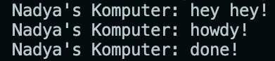
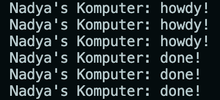
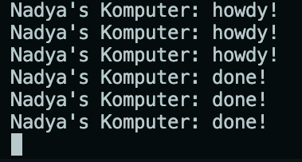

# Times

## 1.2 Understanding how it works

The line printing 'hey hey' is executed before the spawned block. This is because the spawned block is executed asychronously and it doesn't block from executing the following code.

 

## 1.3 Multiple Spawn and removing drop

This screen capture is when there were multiple spawns. All the lines printing 'howdy' is executed before the lines printing 'done' because each spawned block wait 2 seconds before executing the line printing 'done' and in the mean time, the other spawned blocks are also executed.

 

This screen capture is when the drop is removed. The while block inside the `run` method of the `Executor` keep on looping, resulting in the program not stopping. This is because the executor didn't know that there were no more tasks.