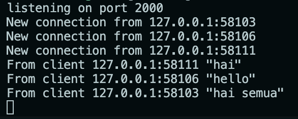
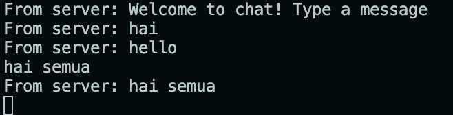
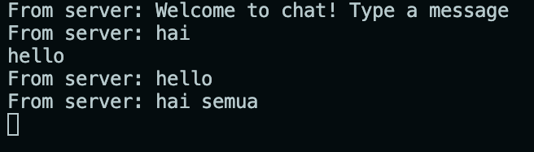
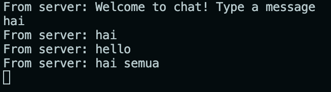
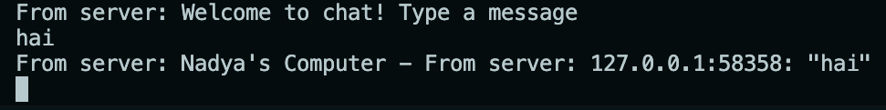

# Tutorial 1: Timer

## 1.2 Understanding how it works

The line printing 'hey hey' is executed before the spawned block. This is because the spawned block is executed asychronously and it doesn't block from executing the following code.

 

## 1.3 Multiple Spawn and removing drop

This screen capture is when there were multiple spawns. All the lines printing 'howdy' is executed before the lines printing 'done' because each spawned block wait 2 seconds before executing the line printing 'done' and in the mean time, the other spawned blocks are also executed.

 

This screen capture is when the drop is removed. The while block inside the `run` method of the `Executor` keep on looping, resulting in the program not stopping. This is because the executor didn't know that there were no more tasks.

 

# Tutorial 2: Broadcast Chat

## 2.1 Original code of broadcast chat

To run the server, use the command `cargo run --bin server` and to run the client, use the command `cargo run --bin client`.

### Server

This is a screen capture of the server console. The server received connections and chats from the clients.

### First client

This is a screen capture of the first client console. The first client received a message from the server when they first made connection and then received messages brodcasted by the second and the third clients. Upon sending the message "hai semua", the first client also received the message sent by itself.

### Second client

This is a screen capture of the second client console. The second client also received a message from the server when they first made connection and then received a message brodcasted by the third client that is sent first. Upon sending the message "hello", the second client also received the message sent by itself. Lastly, it received the message sent by the first client which is sent last.

### Third client

This is a screen capture of the third client console. The third client also received a message from the server. Upon sending the message "hai", the third client also received the message sent by itself. Then, it received messages sent by the first and third clients.

 

## 2.2 Modifying the websocket port

The application still runs properly when the port in both the server and client program is modified to port 8080. It is still using websocket protocol as a websocket server can be ran on any port that the host OS allows. 

## 2.3 Small changes. Add some information to client

This is a screen capture of the client console after the server program is modified to send some information to the client. Upon sending its message, the client received the message back as it is brodcasted to every client. The message included the sender's IP and port, so that all clients that received the brodcast know who sent the message.